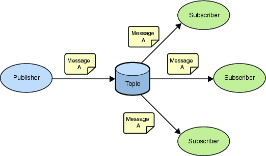
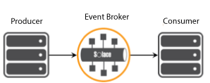
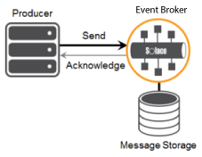
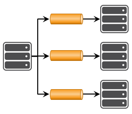
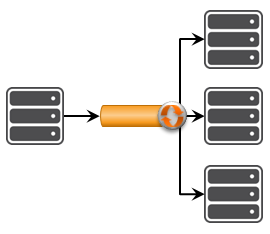
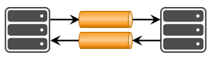
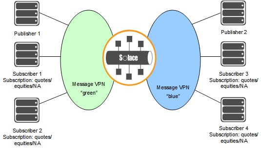
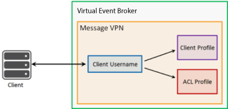
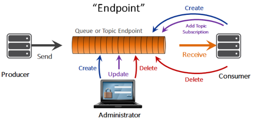

# Core Concepts

- [What is Messaging?](https://docs.solace.com/PubSub-Basics/Core-Concepts-Messaging.htm)                                                                
- [Message Exchange Patterns](https://docs.solace.com/PubSub-Basics/Core-Concepts-Message-Models.htm)                                                                
- [Message VPNs](https://docs.solace.com/PubSub-Basics/Message-VPNs.htm)                                                                
- [Clients](https://docs.solace.com/PubSub-Basics/Core-Concepts-Clients.htm)                                                                
- [Understanding Topics](https://docs.solace.com/PubSub-Basics/Understanding-Topics.htm)                                                                
- [Endpoints and Queues](https://docs.solace.com/PubSub-Basics/Core-Concepts-Endpoints-Queues.htm)                                                                


## What is Messaging?

### Basics

- publisher: the entity that sends or publishes the message (also called a producer

- message: what the publisher wants to say to the subscriber. Messages often  contain events, but can also carry queries, commands, and other  information.

- subscriber: the ultimate receiver of the message (also called a consumer)

  

### Destination

In PubSub+ event brokers, a destination can be a [topic](https://docs.solace.com/PubSub-Basics/Understanding-Topics.htm) or a [queue](https://docs.solace.com/PubSub-Basics/Core-Concepts-Endpoints-Queues.htm) 

### Message Quality of Service (QoS)

Messages can be classified as `Persistent (Guaranteed)` or `Non-Persistent (Direct)` by the message producer.

Direct: (high-speed, loss toleratant)



Guaranteed: (ack)




## Message Exchange Patterns

### MEPs

- [Publish-Subscribe](https://docs.solace.com/PubSub-Basics/Core-Concepts-Message-Models.htm#Publish-)                                                                
- [Point-to-Point](https://docs.solace.com/PubSub-Basics/Core-Concepts-Message-Models.htm#Point-to)                                                                
- [Request-Reply](https://docs.solace.com/PubSub-Basics/Core-Concepts-Message-Models.htm#Request-)                                                                

### Publish-Subscribe



#### Message Replay

Solace CLI commands 

```
solace> enable
solace# admin
solace(admin)# message-spool message-vpn <vpn-name>
```

### Point-to-Point

#### Non-Exclusive Consumption ( [Queue Access Types](https://docs.solace.com/PubSub-Basics/Endpoints.htm#Queue_Access_Types))



#### Endpoint Durability

Queues and topic endpoints can be either durable or temporary.

EMS: static, dynamic

### Request-Reply




## Message VPNs

segregation of topic space and clients



Each event broker has a Message VPN named `default`. 

Message VPN bridges 

* like EMS Route

* published to one Message VPN to be transferred to another

## Clients

To establish a client connection, client applications or devices connect using a specific **Client Username account**.



Each Client Username is associated with a Client Profile and an ACL profile. 

* Client Profile : resource allocation, tuning TCP connection parameters, enabling persistent messaging capabilities
* ACL Profile : defines the Client’s ability to connect based on its IP address


## Topics

### **Topic Endpoints != Topics**

* Topics are a message property 

* Topic endpoints are objects that define the `storage of messages` for a consuming application

Topics have the format `a/b/c/.../n`, where `a, b, c` and so on to `n` are identifiers in a hierarchical scheme you've devised that allows you to classify your information.

### SMF (Solace Message Format)

* NULL-terminated UTF-8 strings 
* `/` character is used as a separator between levels
* maximum of 128 topic levels 
* maximum length of a string, excluding the `NULL` terminator, is 250 bytes 
* case-sensitive
* `<NULL>` is an invalid character.
* `*` is a single-level wildcard.  
* `>` can be used as a wildcard, and is a multi-level wildcard (**one or more**)
* leading `!` indicates a subscription exception
* avoid using `*`  and `>` 

### Topics are Part of the Message Header

Topics as destinations : the message's destination is a topic

Mixed topics in a message stream : A single publisher isn't limited to publishing to a single topic.

### Topics on the Event Broker

* Any topic endpoints whose topic subscriptions match the topics on the incoming messages will receive those messages.
* queues that have been configured with topic subscriptions will receive messages with matching topics
* any of the event broker's clients that have been configured with topic subscriptions will receive messages with matching topics


## Endpoints and Queues

In most scenarios the queue endpoint is a superset of the topic  endpoint, and is the endpoint most commonly used. Topic endpoints are  used by JMS (that is, durable topic subscriptions).



Queues' lifecycles : durable or non-durable. 

### Topic-to-Queue Mapping

In addition to spooling published Guaranteed messages that have a  **matching queue destination**, it's possible to add **one or more topic  subscriptions** to a durable queue

This feature enables queues to participate equally in **point-to-point** and **publish/subscribe** messaging models

### Adding Topic Subscriptions to Queues

```
solace(configure)# message-spool message-vpn <vpn-name>
solace(configure/message-spool)# queue <name> 
solace(configure/message-spool/queue)# subscription topic <topic>
```

### Adding Topic Subscription Exceptions to Queues

```
solace(configure/message-spool/queue)# subscription topic !<topic>
```

### Enabling / Disabling Client Access to Queues

```
solace(configure/message-spool/queue)# no shutdown [ingress | egress | full]
```

```
solace(configure/message-spool/queue)# shutdown [ingress | egress | full]
```