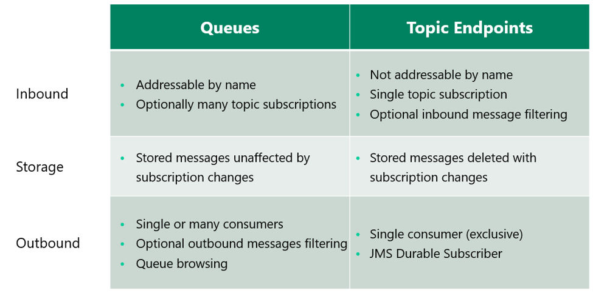
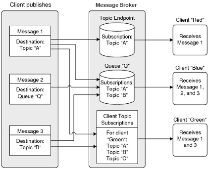

###### Solace Queue VS Topic

queue endpoint is a **superset** of the topic endpoint

### **Which endpoint should you use?**

* Queues are used more often 
  * support for more subscriptions, more consumers, and the ability to read  without removal which is very handy for troubleshooting and special  processing

* topic endpoints were originally created to support durable subscriptions in JMS

# Adding Subscriptions to Endpoints

