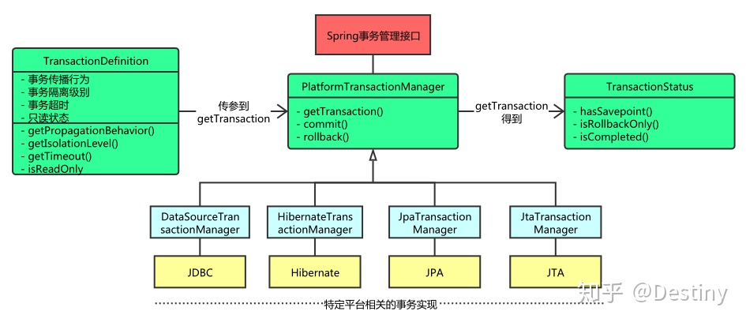

[TOC]
<!-- TOC -->

- [Spring - Transaction Management](#spring---transaction-management)
  - [事务介绍](#事务介绍)
  - [优点](#优点)
  - [Spring 事务的核心类](#spring-事务的核心类)
    - [**PlatformTransactionManager事务管理器(核心)**](#platformtransactionmanager事务管理器核心)
    - [ReactiveTransactionManager反应式事务管理器](#reactivetransactionmanager反应式事务管理器)
    - [TransactionDefinition定义事务基本属性](#transactiondefinition定义事务基本属性)
      - [事务隔离级别](#事务隔离级别)
      - [事务传播行为](#事务传播行为)
      - [事务超时属性(一个事务允许执行的最长时间)](#事务超时属性一个事务允许执行的最长时间)
      - [事务只读属性（对事物资源是否执行只读操作）](#事务只读属性对事物资源是否执行只读操作)
      - [回滚规则（定义事务回滚规则）](#回滚规则定义事务回滚规则)
    - [TransactionStatus为事务代码提供了一种控制事务执行和查询事务状态的简单方法](#transactionstatus为事务代码提供了一种控制事务执行和查询事务状态的简单方法)
  - [编程式事务](#编程式事务)
    - [使用`TransactionTemplate`](#使用transactiontemplate)
    - [使用`TransactionalOperator`](#使用transactionaloperator)
    - [使用`TransactionManager`](#使用transactionmanager)
    - [使用`ReactiveTransactionManager`](#使用reactivetransactionmanager)
  - [声明式事务](#声明式事务)
    - [声明式事务的四种方式](#声明式事务的四种方式)
    - [声明式事务实现示例](#声明式事务实现示例)
    - [回滚声明式事务](#回滚声明式事务)
    - [<tx: advice/>设置](#tx-advice设置)
    - [使用`@Transactional`](#使用transactional)
      - [**`@Transactional` 的作用范围**](#transactional-的作用范围)
      - [**`@Transactional` 的常用配置参数总结**](#transactional-的常用配置参数总结)
      - [多个 事务管理器](#多个-事务管理器)
  - [声明式事务和编程式事务之间的选择](#声明式事务和编程式事务之间的选择)
  - [参考](#参考)

<!-- /TOC -->


# Spring - Transaction Management

## 事务介绍

[事务](https://www.cnblogs.com/lmyupupblogs/p/10248099.html)是一组原子操作单元，从数据库角度说，就是一组SQL指令，要么全部执行成功，若因为某个原因其中一条指令执行有错误，则撤销先前执行过的所有指令。更简答的说就是：**要么全部执行成功，要么撤销不执行**

## 优点

- 跨不同的事务API（比如JTA, JDBC,Hibernate,JTA）



- 支持声明式事务管理

- 与Spring's data有很好的集成
- 与诸如JTA之类的复杂事务API相比，用于编程式事务管理的API更简单

## Spring 事务的核心类

### **PlatformTransactionManager事务管理器(核心)**

```java
public interface PlatformTransactionManager {
  TransactionStatus getTransaction(TransactionDefinition var1) throws TransactionException;

  void commit(TransactionStatus var1) throws TransactionException;

  void rollback(TransactionStatus var1) throws TransactionException;
}
```

Spring并不直接管理事务，通过这个接口，Spring为各个平台如JDBC、Hibernate等都提供了对应的事务管理器，也就是将事务管理的职责委托给Hibernate或者JTA等持久化机制所提供的相关平台框架的事务来实现

如下：

```java
    // 创建JDBC事务管理器
    @Bean(name = "jdbcManager")
    public PlatformTransactionManager jdbcManager(DataSource dataSource) {
        return new DataSourceTransactionManager(dataSource);
    }

    // 创建JPA事务管理器
    @Bean(name = "jpaManager")
    public PlatformTransactionManager jpaManager(EntityManagerFactory factory){
        return new JpaTransactionManager(factory);
    }
```


### ReactiveTransactionManager反应式事务管理器

```java
public interface ReactiveTransactionManager extends TransactionManager {

    Mono<ReactiveTransaction> getReactiveTransaction(TransactionDefinition definition) throws TransactionException;

    Mono<Void> commit(ReactiveTransaction status) throws TransactionException;

    Mono<Void> rollback(ReactiveTransaction status) throws TransactionException;
}
```

从Spring Framework 5.2开始，Spring还为使用反应式类型或Kotlin的反应式应用程序提供了事务管理抽象

如下（参考spring文档代码）：

```java
DefaultTransactionDefinition def = new DefaultTransactionDefinition();
// explicitly setting the transaction name is something that can be done only programmatically
def.setName("SomeTxName");
def.setPropagationBehavior(TransactionDefinition.PROPAGATION_REQUIRED);

Mono<ReactiveTransaction> reactiveTx = txManager.getReactiveTransaction(def);

reactiveTx.flatMap(status -> {

    Mono<Object> tx = ...; // put your business logic here

    return tx.then(txManager.commit(status))
            .onErrorResume(ex -> txManager.rollback(status).then(Mono.error(ex)));
});
```

### TransactionDefinition定义事务基本属性

事务管理器接口 **PlatformTransactionManager** 通过 getTransaction(TransactionDefinition definition) 方法来得到一个事务，这个方法里面的参数是 **TransactionDefinition**类 ，这个类就定义了一些基本的事务属性（**隔离级别、传播行为、是否只读、事务超时、回滚规则**）

```java
public interface TransactionDefinition {
    // 返回事务的传播行为
    int getPropagationBehavior(); 
    
    // 返回事务的隔离级别，事务管理器根据它来控制另外一个事务可以看到本事务内的哪些数据
    int getIsolationLevel(); 
    
    //返回事务的名字
    String getName()；
        
    // 返回事务必须在多少秒内完成
    int getTimeout();  
    
    // 返回是否优化为只读事务。
    boolean isReadOnly();
} 
```

#### 事务隔离级别

什么是事务的隔离级别？隔离级别就是用来描述并发事务之间隔离程度的大小
在并发事务之间如果不考虑隔离性，会引发如下安全性问题：

> **脏读** ：一个事务读到了另一个事务的未提交的数据
> **不可重复读** ：一个事务读到了另一个事务已经提交的 update 的数据导致多次查询结果不一致
> **幻读** ：一个事务读到了另一个事务已经提交的 insert 的数据导致多次查询结果不一致

TransactionDefinition 接口中定义了五个表示隔离级别的常量：

> **TransactionDefinition.ISOLATION_DEFAULT**: 使用后端数据库默认的隔离级别，Mysql 默认采用的 REPEATABLE_READ隔离级别 Oracle 默认采用的 READ_COMMITTED隔离级别.
>
> **TransactionDefinition.ISOLATION_READ_UNCOMMITTED**: 最低的隔离级别，允许读取尚未提交的数据变更，可能会导致脏读、幻读或不可重复读
>
> **TransactionDefinition.ISOLATION_READ_COMMITTED**: 允许读取并发事务已经提交的数据，可以阻止脏读，但是幻读或不可重复读仍有可能发生
>
> **TransactionDefinition.ISOLATION_REPEATABLE_READ**: 对同一字段的多次读取结果都是一致的，除非数据是被本身事务自己所修改，可以阻止脏读和不可重复读，但幻读仍有可能发生。
>
> **TransactionDefinition.ISOLATION_SERIALIZABLE**: 最高的隔离级别，完全服从ACID的隔离级别。所有的事务依次逐个执行，这样事务之间就完全不可能产生干扰，也就是说，该级别可以防止脏读、不可重复读以及幻读。但是这将严重影响程序的性能。通常情况下也不会用到该级别。

#### 事务传播行为

当事务方法被另一个事务方法调用时，必须指定事务应该如何传播。例如：方法可能继续在现有事务中运行，也可能开启一个新事务，并在自己的事务中运行。在**TransactionDefinition**定义中包括了如下几个表示传播行为的常量：

- **支持当前事务的情况**

  - TransactionDefinition.PROPAGATION_REQUIRED： 如果当前存在事务，则加入该事务；如果当前没有事务，则创建一个新的事务。
  - TransactionDefinition.PROPAGATION_SUPPORTS： 如果当前存在事务，则加入该事务；如果当前没有事务，则以非事务的方式继续运行。
  - TransactionDefinition.PROPAGATION_MANDATORY： 如果当前存在事务，则加入该事务；如果当前没有事务，则抛出异常。

- **不支持当前事务的情况**

  - TransactionDefinition.PROPAGATION_REQUIRES_NEW： 创建一个新的事务，如果当前存在事务，则把当前事务挂起。
  - TransactionDefinition.PROPAGATION_NOT_SUPPORTED： 以非事务方式运行，如果当前存在事务，则把当前事务挂起。
  - TransactionDefinition.PROPAGATION_NEVER： 以非事务方式运行，如果当前存在事务，则抛出异常。

- ##### `PROPAGATION_NESTED`

  - TransactionDefinition.PROPAGATION_NESTED： 如果当前存在事务，则创建一个事务作为当前事务的嵌套事务来运行；如果当前没有事务，则该取值等价于TransactionDefinition.PROPAGATION_REQUIRED。

#### 事务超时属性(一个事务允许执行的最长时间)

#### 事务只读属性（对事物资源是否执行只读操作）

#### 回滚规则（定义事务回滚规则）

### TransactionStatus为事务代码提供了一种控制事务执行和查询事务状态的简单方法

事务管理器接口 **PlatformTransactionManager** 通过 getTransaction(TransactionDefinition definition) 方法来得到一个事务，这个方法里面的返回值是 **TransactionStatus**接口：

```java
public interface TransactionStatus extends TransactionExecution, SavepointManager, Flushable {

    @Override
    boolean isNewTransaction();// 是否是新的事物

    boolean hasSavepoint();// 是否有恢复点

    @Override
    void setRollbackOnly();// 设置为只回滚

    @Override
    boolean isRollbackOnly();// 是否为只回滚

    void flush();
}
```


## 编程式事务

在介绍声明式事务之前，我们来看看如何通过Programmatic的方式而不是Declarative方式去使用Spring事务

编程式事务管理方法允许你在对你的源代码编程的帮助下管理事务。这给了你极大地灵活性，但是它很难维护

有两种实现的方式：

- `TransactionTemplate`或`TransactionalOperator`。
- `TransactionManager`直接的实现

### 使用`TransactionTemplate`

```java
public class SimpleService implements Service {

    // single TransactionTemplate shared amongst all methods in this instance
    private final TransactionTemplate transactionTemplate;

    // use constructor-injection to supply the PlatformTransactionManager
    public SimpleService(PlatformTransactionManager transactionManager) {
        this.transactionTemplate = new TransactionTemplate(transactionManager);

        // the transaction settings can be set here explicitly if so desired
        this.transactionTemplate.setIsolationLevel(TransactionDefinition.ISOLATION_READ_UNCOMMITTED);
        this.transactionTemplate.setTimeout(30); // 30 seconds
    }

	//有返回值用TransactionCallback
    public Object someServiceMethod() {
        return transactionTemplate.execute(new TransactionCallback() {
            // the code in this method runs in a transactional context
            public Object doInTransaction(TransactionStatus status) {
                updateOperation1();
                return resultOfUpdateOperation2();
            }
        });
    }
    
    //无返回值用TransactionCallbackWithoutResult
    transactionTemplate.execute(new TransactionCallbackWithoutResult() {
    protected void doInTransactionWithoutResult(TransactionStatus status) {
        try {
            updateOperation1();
            updateOperation2();
        } catch (SomeBusinessException ex) {
            status.setRollbackOnly();//用TransactionStatus来回滚事务
        }
    }
});
}
```

### 使用`TransactionalOperator`

```java
public class SimpleService implements Service {

    // single TransactionOperator shared amongst all methods in this instance
    private final TransactionalOperator transactionalOperator;

    // use constructor-injection to supply the ReactiveTransactionManager
    public SimpleService(ReactiveTransactionManager transactionManager) {
        DefaultTransactionDefinition definition = new DefaultTransactionDefinition();

        // the transaction settings can be set here explicitly if so desired
        definition.setIsolationLevel(TransactionDefinition.ISOLATION_READ_UNCOMMITTED);
        definition.setTimeout(30); // 30 seconds
        // and so forth...

        this.transactionalOperator = TransactionalOperator.create(transactionManager, definition);
    }

    public Mono<Object> someServiceMethod() {

        // the code in this method runs in a transactional context

        Mono<Object> update = updateOperation1();

        return update.then(resultOfUpdateOperation2).as(transactionalOperator::transactional);
    }
}
```

### 使用`TransactionManager`

```java
DefaultTransactionDefinition def = new DefaultTransactionDefinition();
// explicitly setting the transaction name is something that can be done only programmatically
def.setName("SomeTxName");
def.setPropagationBehavior(TransactionDefinition.PROPAGATION_REQUIRED);

TransactionStatus status = txManager.getTransaction(def);
try {
    // put your business logic here
}
catch (MyException ex) {
    txManager.rollback(status);
    throw ex;
}
txManager.commit(status);
```

### 使用`ReactiveTransactionManager`

```java
DefaultTransactionDefinition def = new DefaultTransactionDefinition();
// explicitly setting the transaction name is something that can be done only programmatically
def.setName("SomeTxName");
def.setPropagationBehavior(TransactionDefinition.PROPAGATION_REQUIRED);

Mono<ReactiveTransaction> reactiveTx = txManager.getReactiveTransaction(def);

reactiveTx.flatMap(status -> {

    Mono<Object> tx = ...; // put your business logic here

    return tx.then(txManager.commit(status))
            .onErrorResume(ex -> txManager.rollback(status).then(Mono.error(ex)));
});
```


## 声明式事务

### 声明式事务的四种方式

- 基于 TransactionInterceptor 的声明式事务: Spring 声明式事务的基础，通常也不建议使用这种方式，但是与前面一样，了解这种方式对理解 Spring 声明式事务有很大作用。
- 基于 TransactionProxyFactoryBean 的声明式事务: 第一种方式的改进版本，简化的配置文件的书写，这是 Spring 早期推荐的声明式事务管理方式，但是在 Spring 2.0 中已经不推荐了。
- 基于< tx> 和< aop>命名空间的声明式事务管理： 目前推荐的方式，其最大特点是与 Spring AOP 结合紧密，可以充分利用切点表达式的强大支持，使得管理事务更加灵活。
- 基于 @Transactional 的全注解方式： 将声明式事务管理简化到了极致。开发人员只需在配置文件中加上一行启用相关后处理 Bean 的配置，然后在需要实施事务管理的方法或者类上使用 @Transactional 指定事务规则即可实现事务管理，而且功能也不必其他方式逊色。

### 声明式事务实现示例

```java
// the service interface that we want to make transactional

package x.y.service;

public interface FooService {

    Foo getFoo(String fooName);

    Foo getFoo(String fooName, String barName);

    void insertFoo(Foo foo);

    void updateFoo(Foo foo);

}
```

```java
package x.y.service;

public class DefaultFooService implements FooService {

    @Override
    public Foo getFoo(String fooName) {
        // ...
    }

    @Override
    public Foo getFoo(String fooName, String barName) {
        // ...
    }

    @Override
    public void insertFoo(Foo foo) {
        // ...
    }

    @Override
    public void updateFoo(Foo foo) {
        // ...
    }
}
```

假设`FooService`接口的前两个方法`getFoo(String)`和 `getFoo(String, String)`必须在具有只读的事务的上下文中运行，而其他方法`insertFoo(Foo)`和`updateFoo(Foo)`必须在具有读写的事务的上下文中运行。配置如下：

```xml
<!-- from the file 'context.xml' -->
<?xml version="1.0" encoding="UTF-8"?>
<beans xmlns="http://www.springframework.org/schema/beans"
    xmlns:xsi="http://www.w3.org/2001/XMLSchema-instance"
    xmlns:aop="http://www.springframework.org/schema/aop"
    xmlns:tx="http://www.springframework.org/schema/tx"
    xsi:schemaLocation="
        http://www.springframework.org/schema/beans
        https://www.springframework.org/schema/beans/spring-beans.xsd
        http://www.springframework.org/schema/tx
        https://www.springframework.org/schema/tx/spring-tx.xsd
        http://www.springframework.org/schema/aop
        https://www.springframework.org/schema/aop/spring-aop.xsd">

    <!-- this is the service object that we want to make transactional -->
    <bean id="fooService" class="x.y.service.DefaultFooService"/>

    <!-- the transactional advice (what 'happens'; see the <aop:advisor/> bean below) -->
    <tx:advice id="txAdvice" transaction-manager="txManager">
        <!-- the transactional semantics... -->
        <tx:attributes>
            <!-- all methods starting with 'get' are read-only -->
            <tx:method name="get*" read-only="true"/>
            <!-- other methods use the default transaction settings (see below) -->
            <tx:method name="*"/>
        </tx:attributes>
    </tx:advice>

    <!-- ensure that the above transactional advice runs for any execution
        of an operation defined by the FooService interface -->
    <aop:config>
        <aop:pointcut id="fooServiceOperation" expression="execution(* x.y.service.FooService.*(..))"/>
        <aop:advisor advice-ref="txAdvice" pointcut-ref="fooServiceOperation"/>
    </aop:config>

    <!-- don't forget the DataSource -->
    <bean id="dataSource" class="org.apache.commons.dbcp.BasicDataSource" destroy-method="close">
        <property name="driverClassName" value="oracle.jdbc.driver.OracleDriver"/>
        <property name="url" value="jdbc:oracle:thin:@rj-t42:1521:elvis"/>
        <property name="username" value="scott"/>
        <property name="password" value="tiger"/>
    </bean>

    <!-- similarly, don't forget the TransactionManager -->
    <bean id="txManager" class="org.springframework.jdbc.datasource.DataSourceTransactionManager">
        <property name="dataSource" ref="dataSource"/>
    </bean>

    <!-- other <bean/> definitions here -->

</beans>
```

`<aop:pointcut/>`元素内定义的表达式是AspectJ切入点表达式。有关Spring中切入点表达式的更多详细信息，请参见[AOP部分](https://docs.spring.io/spring/docs/5.3.0-SNAPSHOT/spring-framework-reference/core.html#aop)。

运行：

```java
public final class Boot {

    public static void main(final String[] args) throws Exception {
        ApplicationContext ctx = new ClassPathXmlApplicationContext("context.xml", Boot.class);
        FooService fooService = (FooService) ctx.getBean("fooService");
        fooService.insertFoo (new Foo());
    }
}
```

### 回滚声明式事务

您可以精确配置哪些`Exception`类型将事务标记为回滚，包括已检查的异常。如下:

```java
<tx:advice id="txAdvice" transaction-manager="txManager">
    <tx:attributes>
    <tx:method name="get*" read-only="true" rollback-for="NoProductInStockException"/>
    <tx:method name="*"/>
    </tx:attributes>
</tx:advice>
```

如果您不希望在引发异常时回滚事务，则还可以指定“无回滚规则”，如下:

```java
<tx:advice id="txAdvice">
    <tx:attributes>
    <tx:method name="updateStock" no-rollback-for="InstrumentNotFoundException"/>
    <tx:method name="*"/>
    </tx:attributes>
</tx:advice>
```

您还可以通过编程方式指示所需的回滚,会使业务代码和spring事务管理代码紧密耦合,如下:

```java
public void resolvePosition() {
    try {
        // some business logic...
    } catch (NoProductInStockException ex) {
        // trigger rollback programmatically
        TransactionAspectSupport.currentTransactionStatus().setRollbackOnly();
    }
}
```

### <tx: advice/>设置

默认设置为：

- 事务传播设置是 `REQUIRED`
- 隔离级别是 `DEFAULT`
- 事务是 读/写
- 事务超时默认是依赖于事务系统的，或者事务超时没有被支持。
- 任何 `RuntimeException` 将触发事务回滚，但是任何 checked `Exception` 将不触发事务回滚

这些默认的设置当然也是可以被改变的。 `<tx:advice/>` 和 `<tx:attributes/>` 标签里的 `<tx:method/>` 各种属性设置总结如下：

| 属性              | 需要？ | 默认       | 描述                                                         |
| :---------------- | :----- | :--------- | :----------------------------------------------------------- |
| `name`            | 是     |            | 与事务属性关联的方法名称。通配符（*）字符可以被用于相同的事务属性的设置有许多方法相关联（例如，get *, handle *, on * Event, 等等）。 |
| `propagation`     | 不     | `REQUIRED` | 事务传播行为。                                               |
| `isolation`       | 不     | `DEFAULT`  | 事务隔离级别。                                               |
| `timeout`         | 不     | -1         | 事务超时（秒）。                                             |
| `read-only`       | 不     | false      | 读写与只读事务。                                             |
| `rollback-for`    | 不     |            | 将被触发进行回滚的 `Exception(s)`；以逗号分开。例如`com.foo.MyBusinessException,ServletException`。 |
| `no-rollback-for` | 不     |            | *不* 被触发进行回滚的 `Exception(s)`；以逗号分开。 如：`'com.foo.MyBusinessException,ServletException'` |

### 使用`@Transactional`

除了基于XML的声明式方法进行事务配置外，还可以使用基于注解的方法。

例如：

在XML配置中，用`<tx:annotation-driven/>`标记开启事务使用注解：

```xml
<!-- from the file 'context.xml' -->
<?xml version="1.0" encoding="UTF-8"?>
<beans xmlns="http://www.springframework.org/schema/beans"
    xmlns:xsi="http://www.w3.org/2001/XMLSchema-instance"
    xmlns:aop="http://www.springframework.org/schema/aop"
    xmlns:tx="http://www.springframework.org/schema/tx"
    xsi:schemaLocation="
        http://www.springframework.org/schema/beans
        https://www.springframework.org/schema/beans/spring-beans.xsd
        http://www.springframework.org/schema/tx
        https://www.springframework.org/schema/tx/spring-tx.xsd
        http://www.springframework.org/schema/aop
        https://www.springframework.org/schema/aop/spring-aop.xsd">

    <!-- this is the service object that we want to make transactional -->
    <bean id="fooService" class="x.y.service.DefaultFooService"/>

    <!-- enable the configuration of transactional behavior based on annotations -->
    <tx:annotation-driven transaction-manager="txManager"/><!-- a TransactionManager is still required --> 

    <bean id="txManager" class="org.springframework.jdbc.datasource.DataSourceTransactionManager">
        <!-- (this dependency is defined somewhere else) -->
        <property name="dataSource" ref="dataSource"/>
    </bean>


</beans>
```

然后就可以在代码使用注解提供事务功能

```java
// the service class that we want to make transactional
@Transactional
public class DefaultFooService implements FooService {

    Foo getFoo(String fooName) {
        // ...
    }

    Foo getFoo(String fooName, String barName) {
        // ...
    }

    void insertFoo(Foo foo) {
        // ...
    }

    void updateFoo(Foo foo) {
        // ...
    }
}
```

#### **`@Transactional` 的作用范围**

- **方法** ：推荐将注解使用于方法上，不过需要注意的是：**该注解只能应用到 public 方法上，否则不生效。**
- **类** ：如果这个注解使用在类上的话，表明该注解对该类中所有的 public 方法都生效。
- **接口** ：不推荐在接口上使用。

#### **`@Transactional` 的常用配置参数总结**

| Property                                                     | Type                                                         | Description                                                  |
| :----------------------------------------------------------- | :----------------------------------------------------------- | :----------------------------------------------------------- |
| [value](https://docs.spring.io/spring/docs/5.3.0-SNAPSHOT/spring-framework-reference/data-access.html#tx-multiple-tx-mgrs-with-attransactional) | `String`                                                     | Optional qualifier that specifies the transaction manager to be used. |
| [propagation](https://docs.spring.io/spring/docs/5.3.0-SNAPSHOT/spring-framework-reference/data-access.html#tx-propagation) | `enum`: `Propagation`                                        | Optional propagation setting.                                |
| `isolation`                                                  | `enum`: `Isolation`                                          | Optional isolation level. Applies only to propagation values of `REQUIRED` or `REQUIRES_NEW`. |
| `timeout`                                                    | `int` (in seconds of granularity)                            | Optional transaction timeout. Applies only to propagation values of `REQUIRED` or `REQUIRES_NEW`. |
| `readOnly`                                                   | `boolean`                                                    | Read-write versus read-only transaction. Only applicable to values of `REQUIRED` or `REQUIRES_NEW`. |
| `rollbackFor`                                                | Array of `Class` objects, which must be derived from `Throwable.` | Optional array of exception classes that must cause rollback. |
| `rollbackForClassName`                                       | Array of class names. The classes must be derived from `Throwable.` | Optional array of names of exception classes that must cause rollback. |
| `noRollbackFor`                                              | Array of `Class` objects, which must be derived from `Throwable.` | Optional array of exception classes that must not cause rollback. |
| `noRollbackForClassName`                                     | Array of `String` class names, which must be derived from `Throwable.` | Optional array of names of exception classes that must not cause rollback. |
| `label`                                                      | Array of `String` labels to add an expressive description to the transaction. | Labels may be evaluated by transaction managers to associate implementation-specific behavior with the actual transaction. |

#### 多个 事务管理器

大多数Spring应用程序仅需要一个事务管理器，但是在某些情况下，您可能需要在一个应用程序中使用多个独立的事务管理器。

例如:

```java
public class TransactionalService {

    @Transactional("order")
    public void setSomething(String name) { ... }

    @Transactional("account")
    public void doSomething() { ... }

    @Transactional("reactive-account")
    public Mono<Void> doSomethingReactive() { ... }
}
```

```xml
	<tx:annotation-driven/>

    <bean id="transactionManager1" class="org.springframework.jdbc.datasource.DataSourceTransactionManager">
        ...
        <qualifier value="order"/>
    </bean>

    <bean id="transactionManager2" class="org.springframework.jdbc.datasource.DataSourceTransactionManager">
        ...
        <qualifier value="account"/>
    </bean>

    <bean id="transactionManager3" class="org.springframework.data.r2dbc.connectionfactory.R2dbcTransactionManager">
        ...
        <qualifier value="reactive-account"/>
    </bean>
```

如果不指定，默认使用`<tx:annotation-driven>`目标bean名称。

## 声明式事务和编程式事务之间的选择

仅当您执行少量事务操作时，使用编程式事务。在这种情况下，使用 `TransactionTemplate`，能够显式设置事务名称也是只能通过使用编程方法进行事务管理来完成的事情。

如果您的应用程序具有大量事务操作，则声明式事务管理通常是值得的。它使事务管理脱离业务逻辑，而且配置简单，降低维护成本。

## 参考

1. https://blog.csdn.net/qq_34337272/article/details/80394121
2. https://zhuanlan.zhihu.com/p/112183409
3. https://docs.spring.io/spring/docs/5.3.0-SNAPSHOT/spring-framework-reference/data-access.html#tx-decl-explained
4. [https://github.com/love-somnus/Spring/wiki/Spring%E4%BA%8B%E5%8A%A1%E7%9A%84%E4%BC%A0%E6%92%AD%E7%89%B9%E6%80%A7](https://github.com/love-somnus/Spring/wiki/Spring事务的传播特性)

